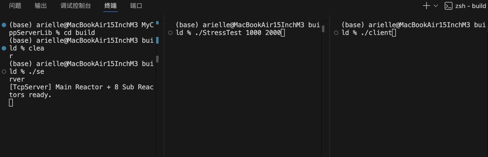
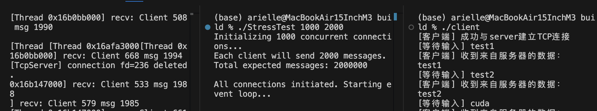
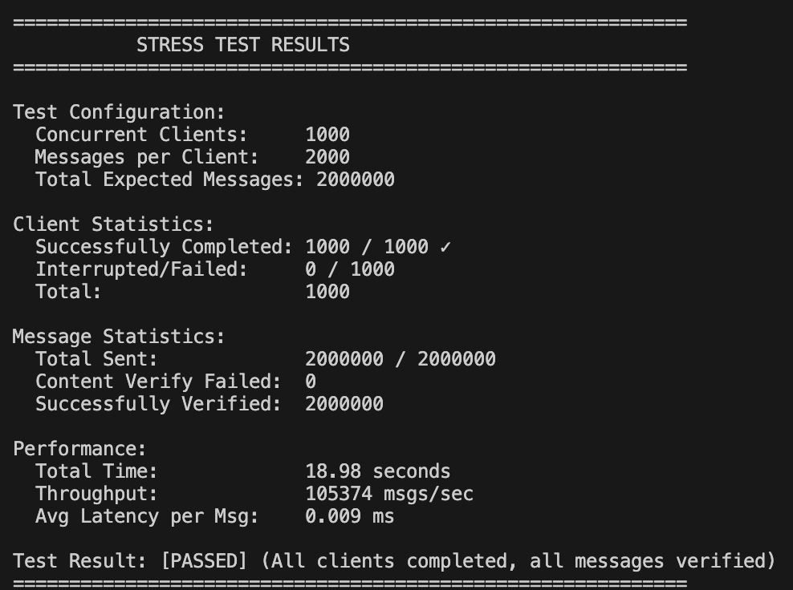

# MyCppServerLib

一个参考 muduo 思路、基于 Reactor 模型实现的手写 C++ 网络库学习项目。

项目目标不是复刻完整的工业级框架，而是通过从零实现关键组件，理解高并发 TCP 服务器的核心机制，包括：

- 非阻塞 socket
- IO 多路复用（Linux 下 epoll，macOS 下 kqueue）
- Main Reactor + Sub Reactor 多线程模型
- 事件分发与回调
- 输入输出缓冲区
- 线程池与跨线程任务投递
- 连接生命周期管理与安全退出

当前仓库已经可以运行一个多线程 echo server，并附带简单客户端和并发压力测试程序。







## 项目特性

- 跨平台 IO 多路复用抽象
	- Linux 使用 epoll
	- macOS 使用 kqueue
- 多 Reactor 架构
	- 1 个主 Reactor 负责 accept 新连接
	- 多个子 Reactor 负责已建立连接的 IO 事件处理
- 非阻塞 IO + 边缘触发
	- Connection 默认以非阻塞方式工作
	- 读路径按 ET 模式循环读取直到 EAGAIN
- 线程池驱动的子 Reactor 运行模型
- 基于 Buffer 的收发缓冲管理
- 连接回调机制
	- 新连接回调
	- 消息回调
- 支持优雅关闭
	- 支持 SIGINT 触发 server.stop()
	- 通过 wakeup 机制唤醒阻塞中的事件循环
- 自带压力测试程序 StressTest

## 当前项目定位

这是一个学习项目，重点在于把网络库中最关键的基础设施亲手实现出来，并逐步修正并发、生命周期和跨线程调度中的细节问题。

它已经具备“高并发服务器框架”的基本形态，但仍然不是一个完整的工业级通用网络库。比如：

- 目前默认业务示例是 echo server
- 监听地址和端口在示例中写死为 127.0.0.1:8888
- 暂未提供定时器、日志系统、配置系统、协议编解码器等更完整的基础设施
- 压测结果会受到操作系统 fd 限制、临时端口范围和本机资源的影响

如果你的目标是学习 Reactor 网络编程、理解 muduo 类库的设计思路，这个项目已经足够作为一个完整阶段性成果。

## 架构概览

整体结构采用经典的 Main Reactor + Sub Reactor 模型：

```text
								+-------------------+
								|    TcpServer      |
								+-------------------+
												 |
						 +-----------+-----------+
						 |                       |
		 +---------------+      +----------------+
		 |  mainReactor  |      |   ThreadPool   |
		 +---------------+      +----------------+
						 |
				 +--------+
				 |Acceptor|
				 +--------+
						 |
			accept new connection
						 |
		 +-----------------------+
		 | fd -> selected loop   |
		 +-----------------------+
						 |
		+--------+--------+--------+
		|                 |         |
 +--------+      +--------+  +--------+
 |subLoop0|      |subLoop1|  |subLoopN|
 +--------+      +--------+  +--------+
			|               |           |
	+--------+      +--------+  +--------+
	|Channel |      |Channel |  |Channel |
	+--------+      +--------+  +--------+
			|               |           |
	+--------+      +--------+  +--------+
	|Connection      Connection   ...    |
	+------------------------------------+
```

核心流程如下：

1. TcpServer 创建主 Reactor、Acceptor、线程池和多个子 Reactor。
2. Acceptor 在监听 socket 上等待新连接到来。
3. 新连接建立后，TcpServer 将连接分配给某个子 Reactor。
4. 子 Reactor 通过 Poller 等待连接上的读写事件。
5. Channel 将 IO 事件分发给 Connection。
6. Connection 负责收发数据，并在读到数据后触发业务回调。

## 核心模块说明

### Eventloop

事件循环核心，负责：

- 调用 Poller 等待 IO 事件
- 执行活跃 Channel 的回调
- 执行其他线程投递过来的 pending functors
- 通过 eventfd 或 pipe 实现跨线程唤醒

### Poller

对平台相关 IO 多路复用接口的抽象层：

- Linux: epoll
- macOS: kqueue

它负责：

- 注册/更新/删除 Channel 关注的事件
- 等待内核返回就绪事件
- 将平台事件转换为项目内部统一的事件标志

### Channel

对“文件描述符 + 关注事件 + 回调函数”的封装。

它本身不拥有 fd，只负责描述：

- 当前 fd 关注哪些事件
- 当前 fd 实际就绪了哪些事件
- 这些事件到来时该调用哪个回调

### Connection

一个 TCP 连接的抽象，负责：

- 持有 socket
- 持有输入缓冲区和输出缓冲区
- 处理可读/可写事件
- 在连接关闭或出错时触发删除流程
- 暴露 send 接口给上层业务回调使用

### Acceptor

监听连接入口：

- 创建监听 socket
- bind 到 127.0.0.1:8888
- listen
- 接收客户端连接
- 将新连接的 fd 回调给 TcpServer

### TcpServer

对外的服务器入口对象，负责组织整个框架：

- 创建主从 Reactor
- 管理所有 Connection
- 设置新连接回调和消息回调
- 提供 Start 和 stop 接口

### Buffer

可增长的缓冲区实现，支持：

- readable / writable / prependable 三段区域管理
- append 写入
- retrieve 读取回收
- 从 fd 直接读取到缓冲区

### ThreadPool

用于运行多个子 Reactor 的事件循环，也可作为通用任务执行器。

## 代码目录

```text
.
├── CMakeLists.txt
├── README.md
├── HISTORY/                 # 按开发阶段保留的历史版本快照
├── src/
│   ├── server.cpp           # 示例 echo server
│   ├── client.cpp           # 简单阻塞式测试客户端
│   ├── common/              # 各核心模块实现
│   ├── include/             # 头文件
│   └── test/
│       ├── StressTest.cpp   # 并发连接/消息压测程序
│       └── ThreadPoolTest.cpp
└── build/                   # 构建输出目录
```

HISTORY 目录保存了按阶段演进的历史实现，适合回溯学习过程、对比重构前后的代码结构。

## 构建环境

建议环境：

- CMake 3.21 及以上
- 支持 C++17 的编译器
	- macOS: Apple Clang
	- Linux: GCC 或 Clang
- POSIX 线程库

项目当前已针对以下平台做了适配：

- macOS
- Linux

## 构建方法

### 使用 CMake 命令行

```bash
cmake -DCMAKE_BUILD_TYPE=Debug -S . -B build
cmake --build build -j 4
```

构建完成后，默认会生成以下可执行文件：

- build/server
- build/client
- build/StressTest
- build/ThreadPoolTest

### 使用 VS Code 任务

当前工作区已经配置了以下任务：

- CMake Configure Debug
- Build Project
- Clean and Build

如果你在 VS Code 中打开本仓库，可以直接运行这些任务进行构建。

## 运行示例

### 1. 启动服务端

```bash
cd build
./server
```

默认监听：

- 地址：127.0.0.1
- 端口：8888

服务端当前行为是一个 echo server：收到什么，就回写什么。

### 2. 启动简单客户端

```bash
cd build
./client
```

客户端会连接到本地 8888 端口，并从标准输入读取文本，发送给服务端，然后打印服务端回显。

### 3. 运行线程池测试

```bash
cd build
./ThreadPoolTest
```

该程序会向线程池提交若干任务，用于验证基本的线程池执行行为。

## 压力测试

项目提供了一个简单的并发压力测试程序：

```bash
cd build
./StressTest [clients_num] [msgs_num] [wait_seconds]
```

参数说明：

- clients_num: 并发客户端数量，默认 100
- msgs_num: 每个客户端发送的消息数，默认 10000
- wait_seconds: 每发起一个连接后额外 sleep 的秒数，默认 0

示例：

```bash
./StressTest 1000 2000
```

StressTest 的行为是：

- 批量发起非阻塞连接
- 每个连接循环发送消息并等待 echo 回包
- 校验回包内容是否与发送内容一致
- 输出总耗时、吞吐量、平均延迟和失败统计

## 已实现的关键设计点

结合当前代码，项目已经覆盖了以下比较重要的工程细节：

- 使用平台相关 Poller 的统一抽象屏蔽 epoll/kqueue 差异
- 在 ET 模式下循环读取直到 EAGAIN，避免遗漏数据
- 通过 queueInLoop 把跨线程操作投递到所属 Eventloop 执行
- 通过 wakeup 机制打断阻塞中的 poll，保证跨线程任务及时执行
- 控制 Connection 的销毁时机，避免 Channel 指针悬空和 use-after-free
- 在 stop 和析构流程中先退出事件循环，再回收线程和连接对象
- Signal 处理逻辑做了幂等保护，避免重复关闭

这些细节恰恰是手写网络库中最容易出错的部分，也是这个项目最有学习价值的地方。

## 当前限制与注意事项

这部分非常重要，因为它决定了你如何理解压测结果。

### 1. 单机压测不等于服务端真实上限

如果客户端和服务端跑在同一台机器上，压测会同时受到以下因素限制：

- 单进程可打开的文件描述符上限
- 本机临时端口范围
- 本机 CPU、内存和内核网络栈限制

因此，当你看到十万连接压不上去时，不一定是代码本身不行，可能只是操作系统资源限制先到了。

### 2. 当前示例业务比较简单

server.cpp 里的业务逻辑是“收到消息后原样回写”，它适合作为网络框架正确性的验证，不代表复杂业务场景下的最终性能。

### 3. 仍缺少更完整的工程化组件

例如：

- 定时器系统
- 更完善的错误码与日志体系
- 更通用的编解码层
- 连接空闲超时管理
- 配置化监听地址与端口
- 更系统的单元测试和 benchmark 体系

## 适合怎样阅读这个项目

建议按下面顺序阅读：

1. 从 server.cpp 和 TcpServer 开始，先看整体控制流。
2. 再看 Eventloop、Poller、Channel，理解事件循环与事件分发。
3. 然后看 Connection 和 Buffer，理解连接读写与缓冲区管理。
4. 最后看 StressTest，对照运行结果理解项目在高并发下的行为。
5. 如果想回溯设计演进，可以继续阅读 HISTORY 目录下的阶段版本。

## 项目目标回顾

这个项目最核心的价值，不是“做出一个功能最多的库”，而是：

- 把高并发网络库的核心骨架亲手实现一遍
- 把 Reactor 模型从概念真正落到代码
- 在真实并发场景中理解线程、IO 复用、生命周期和资源限制

如果你也在学习 muduo、Reactor 模型、epoll 或 kqueue，这个仓库可以作为一个从基础实现走向工程思维的练习样本。
